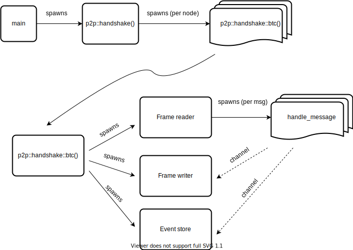

## Architectural Decision Record 🔴

Lets record here all the relevant decisions for this project. This document is intended to change over time. Git history can be used to see its progression.

### The Bitcoin handshake

The first implementation for the `p2p-handshake` project will be the [Bitcoin handshake](https://github.com/bitcoinbook/bitcoinbook/blob/develop/ch08.asciidoc#network_handshake). 

A low level, own TCP protocol message set, could be implemented by using something like [byteorder](https://github.com/BurntSushi/byteorder) crate. But in order to be more practical, lets try the [rust-bitcoin](https://github.com/rust-bitcoin/rust-bitcoin) library. It looks perfectly scoped for the use case, as it already provides the network messages types, serialization and deserialization capabilities out of the box. The only problem is that [it still doesn't support](https://github.com/rust-bitcoin/rust-bitcoin/issues/1251) an `async` interface, so we will need to workaround the limitation of only accepting the sync version of [std::io::ReadBuf](https://doc.rust-lang.org/std/io/struct.BufReader.html#) on their principal decoding method, by using its low level de-serialization functions.

### Project structure

The current project structure favours the placement of reusable elements as part of the `lib.rs` crate,
while leaving the `main.rs` just for the application code. At some point in future the `lib.rs` one should
be properly documented if finally exposed.

```bash
.
├── src
│   ├── lib.rs   ## The lib crate.
│   ├── main.rs  ## The application main crate.
│   ├── p2p      ## The P2P module and submodules.
│   │   ├── btc.rs
│   │   ├── config.rs
│   │   └── view.rs
│   └── p2p.rs
├── tests
│   └── integration_test.rs ## The test that reaches real nodes.
```

### A CLI tool

There are some parameters that can be tuned for both, the application execution (like timeouts) and the handshake itself, like protocol message fields values.

Being a CLI will make it more ergonomic for human interaction. We are going to use the [clap](https://docs.rs/clap/latest/clap/) crate for speeding up things and to provide a proper growth vector for the project.

### An async rust program  

This tool is going to interact with the network. Thats an IO-bound task in which certain concurrency/parallelism levels can improve performance.

This time the decision is to adopt the well known [tokio](https://tokio.rs/) async runtime. Tokio by default will spin up as natives threads as cores for executing `tasks`, by using a work stealing algorithm. Apart from being able of switching among tasks when the current one is busy (awaiting), it will also alleviate the overhead of creating native threads for processing each network message. 

This project implements an [actor model](https://en.wikipedia.org/wiki/Actor_model) that can be thought in the following way:




Important things to note, is that all the tasks that creates other tasks are also responsible about its termination and error handling. This goes in cascade for all the operations.

Not visible in the above diagram, but there are also service channels that will take care of gracefully shutdown of every task.

Thanks to this model all the concurrent accesses to data are protected/serialized by default, so we can avoid implementing mutexes.

### Feedback for the user

Its interesting to know whats happening during the execution of the program. So the following information will be shown:

* The status of the operation: succeeded, timed out or failed.
* The kind of messages the program is processing and the direction, which can be `inbound` or `outbound`.
* Time elapsed among each message (_orientative_).
* Total operation time per handshake.

Currently we are only presenting an human readable output. But machine readable could be evaluated in the future.

### Ability to pass multiple node address

Once we have the logic or executing one handshake, it should not be a problem to allow passing (optionally) multiple hosts and process each handshake concurrently. The good parts of choosing an async runtime like Tokio makes this a breeze.

### Open to extension, closed to modification 

The program structure invites other p2p handshake implementations to be implemented. That was done by hosting the current one (BTC) under the the `btc` CLI subcommand, allowing other subcommands for the next implementations to be easily set up.

The code also [favours this](https://github.com/eloylp/p2p-handshake/blob/main/src/p2p.rs#L20), as a different p2p module could be invoked depending on the commented CLI subcommand. It just need to accomplish the current signatures.

Summarizing, we are pretending to facilitate a growth vector for the project to new developers.

### Processing messages

Currently we are using a mutable growing buffer [BytesMut](https://docs.rs/bytes/latest/bytes/struct.BytesMut.html) for bringing the message bytes from the network to memory, so we can parse them accordingly. The initial buffer size its currently hardcoded to 1024 bytes, being a complete handshake around 342 bytes. So it should be enough for a complete handshake without the need of growing the buffer, so no more allocations than the initial one.

After a message its successfully parsed from its binary representation, its data and the buffer part it occupies are automatically discarded.

Other alternative idea (not implemented here) would be to make use of a [circular buffer](https://en.wikipedia.org/wiki/Circular_buffer) implementation. That would avoid the costs of allocating more space as we go by reusing the already allocated but discarded one. So instead of discarding old parts of the buffer with the consequent future allocation, they would just be overwritten, using cursors to control what data is still valid or not. As commented, the current implementation is considered good enough for now, as we are pre-allocating all the needed memory beforehand.

### Error handling

The strategy for dealing with errors its very simple. We created a `P2PError` type to which all the other errors can be converted `From`. We are only interested in getting the error messages and properly propagate them to the user. We currently do not intend to intercept the errors and react to them specifically at any point. Its just reporting.

Although we use the same error structure for everything, errors have different treatment depending their nature:

* Runtime errors. This errors are going to interrupt the entire program. This are very rare and unexpected.
* Handshake errors. This are expected ones. One server can be just down for whatever reason. Such error will be added to the final `HandshakeResult` and properly presented to the user along the other results. 

### Testing

The testing could be improved. Currently we need to reach real servers in order to assess the program its working correctly. That could be an impediment for local development if, as an example, one does not have internet or the target nodes are down.

A possible complementary solution for the above would be to build an special mock server for emulating the real ones. With such server, we could also test other edge case scenarios like network timeouts. So developers can test locally and leave the real server part only for the CI. The decision is to leave that idea for another moment, as we consider it out of the scope of this exercise.

### References

* https://en.bitcoin.it/wiki/Protocol_documentation#Message_structure
* https://en.bitcoin.it/wiki/Protocol_documentation#version
* https://en.bitcoin.it/wiki/Protocol_documentation#verack